# AmazonReview

## Project Overview
* **Aspect Based Sentiment Analysis** on product reviews to detect sentiments on different product's characteristics.
* **Sentiment Analysis** of reviews to detect correlations between text polarity and review's score.
* **Classification** of positive and negative reviews based on the text of the review.

## Data Exploration
The dataset contains 35169 different food reviews from Amazon.

### Features
- `productID`: unique identifier for the product
- `userID`: unique identifier for the user
- `score`: rating between 1 and 5
- `text`: text of the review

### Opinion Score
Here is the distribution of the score:

It's easy to notice that most of the evaluations are 4 and 5, with an average of 4.16. In fact, the reviews with a score of 5 constitute 64% of the total reviews, followed by those with a score of 4 (12%), 1 (9%), 3 (8%) and
2 (5%).

It is therefore decided to introduce a new opinion attribute that is set to `negative` when a review has a score between 1 and 2, `positive` when the score is 4 or 5, and `neutral` for a value of 3.

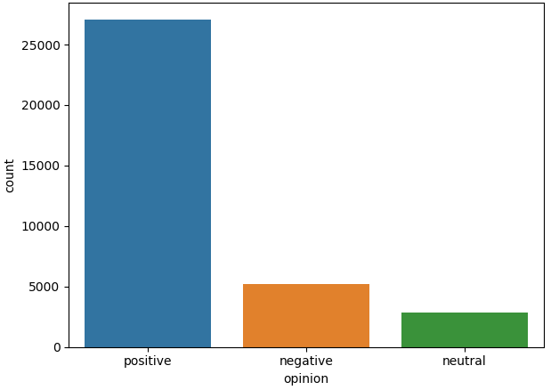

With this new classification, 77% of fine food reviews are considered positive, 15% of them are considered negative and 8% neutral.

### Text review

The data contained `text` column is an unstructured text. By just looking at the first characters, you can immediately have an idea of whether the review is positive or negative.
In the negative reviews there are often expressions such as "not good" or "do not like it". These negative expressions can also be more nuanced depending on the context, for example "were actually small sized." 
For positive reviews, users use positive expressions as "great taffy", "great price", "wide assortiment", "yummy taf-
fy "," very enjoyable ", etc.

A common approach to distinguish positive from negative reviews is to look at the frequency of the words: certain words, such as "excellent" or "very tasty," tend to occur more often in positive reviews than negative reviews.

After calculating the ratio between the frequency count in the positive review divided by the frequency count in the negative review for each word, the results are shown in the following wordclouds.

When the ratio is high (greater than 1), it means than the words tend to occur more often in positive reviews than in negative reviews.

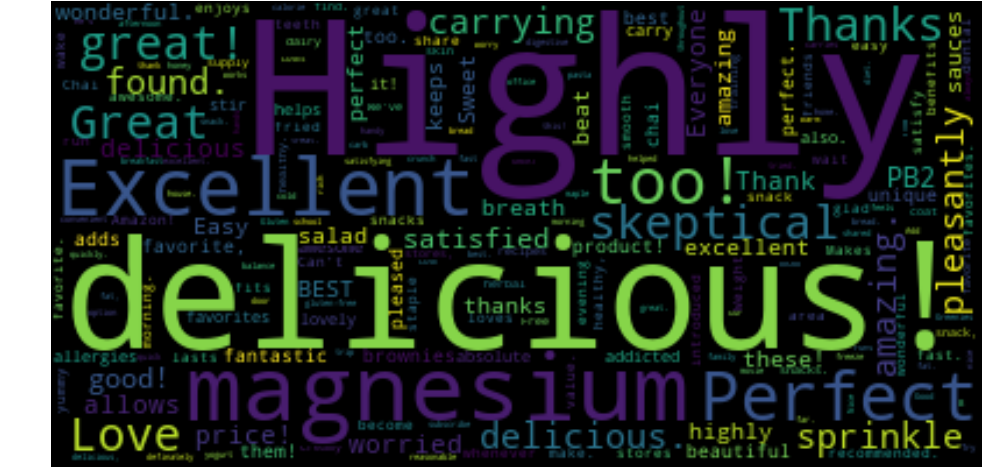

In the wordcloud above, some words that stand out are "delicious", "excellent ", " love ", "perfect", which have a positive meaning. Certain ingredients or products are also highlighted such as "salad", "sauces", "snacks", etc.  These word are neutral, but probably appear often in positive reviews as a result of Amazon's inventory.

Let's look now at the words that tend to occur more often in negative reviews than in positive reviews.

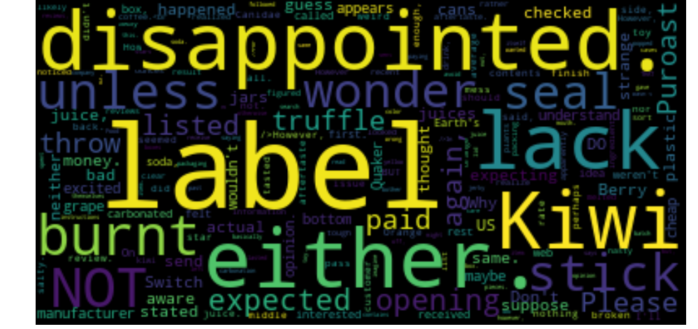

There are several negative words, such as "disappointed", "burnt" or "not". However it's more difficult to understand why certain words like "kiwi", "berry" or "buyer" appear more often in negative reviews.

## Data Preprocessing
In order to train the model, it is necessary to transform the reviews into the right format. The following steps has been made:
* Remove HTML tags
* Remove stopwords and punctuations
* Generate a Document Term Matrix (A mathematical matrix that describes the frequency of terms that occur in a collection of documents)

The Document Term Matrix is built with a package called `gensim` and a word dictionary is created by assigning a unique integer ID to each unique token collecting the token occurrence count in the text. Later this dictionary is converted into a bag-of-words: a simple rappresentation that associates a token to its frequency inside the text.

## Aspect Based Sentiment Analysis

This section presents the study of Aspect Based Sentiment Analysis performed on product reviews. In particular, the 10 products with more reviews inside the dataset has been chosen to perform the analysis. This study aims to identify, for each product, different characteristics reviewed by users in order to study their sentiment.

This section will take into consideration the product with `productId` *B002QWP89S*, as it is the one with more reviews inside the dataset. The product examined concerns food for animals. The following screenshot shows the related Amazon webpage.

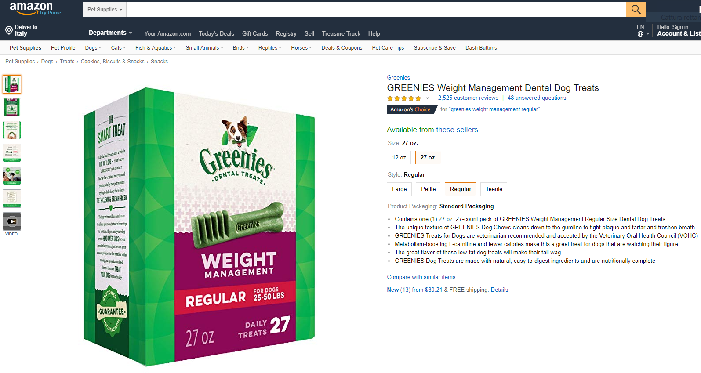

### LDA model
The LDA (Latent Dirichlet Allocation) model is a natural language analysis model that allows to understand the semantic meaning of the text by analyzing the similarity between the distribution of the terms of the document with that of a specific topic or a entity.

#### Optimal number of topics
To calculate the optimal number of topics, 10 different models are generated, each with the number of topics to be identified ranging from 1 to 10. For each model generated the topic coherence is calculated and the one with the highest topic coherence value is chosen.

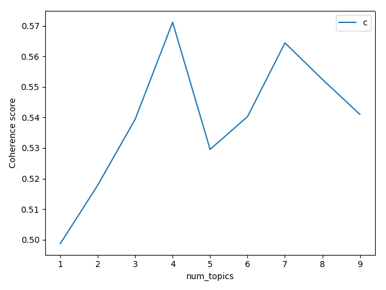

In this case, the ideal topic number for this product is 4. The LDA model is then created by setting to 4 the parameter relative to the number of topics to search for in the text.

#### Topic Visualization
In the model shown previously, 4 different topics have been identified, each of which consists of a combination of keywords to which it is assigned a weight that indicates how much that term represents the topic to which it belongs. The `pyLDAvis` package allows you to view an interactive graph that clearly shows the subdivision of the topics.

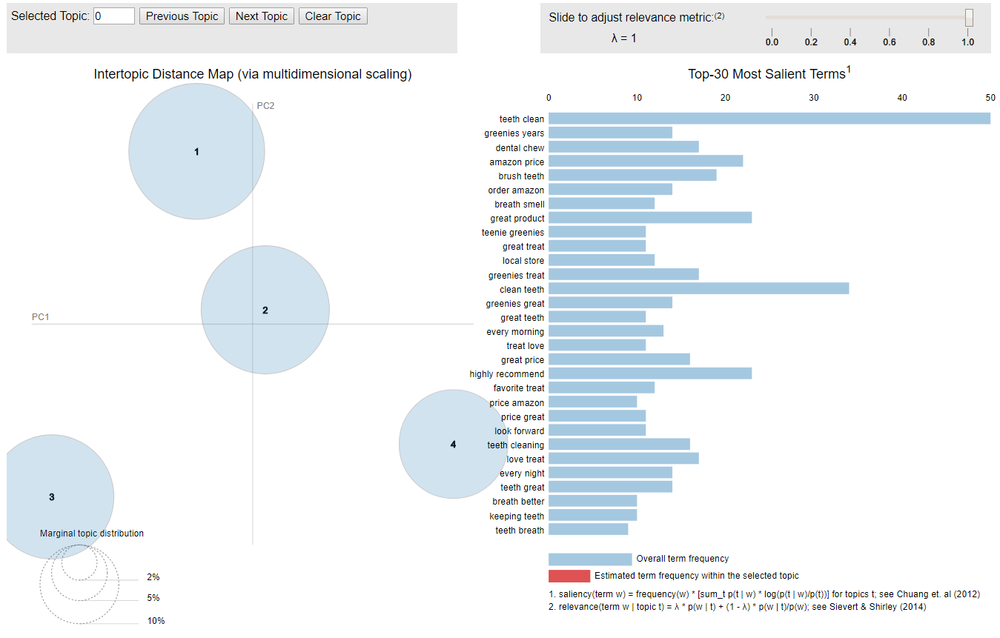

Selectiong, for example, topic 3, the terms that appear most frequently are "teeth clean", "dental chew", "teeth great" and "clean teeth", terms related to the teeth cleaning offered by the product.

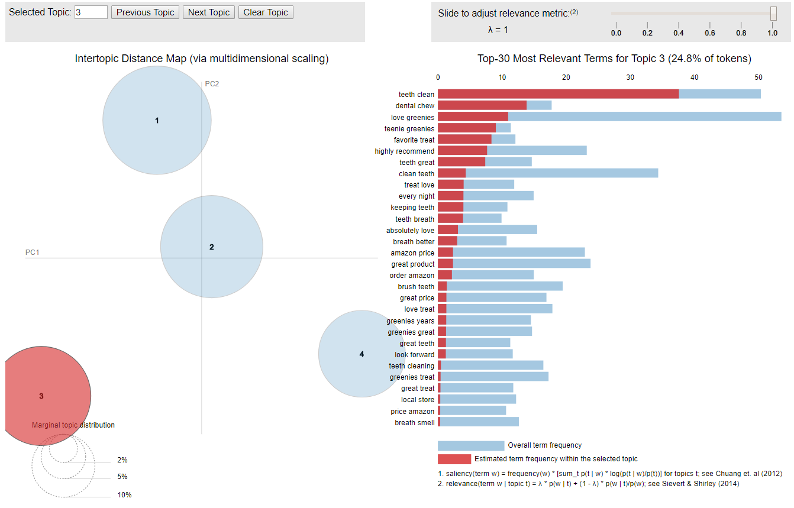

#### Sentiment of each topic
For every topic is then calculated the polarity. Polarity is expressed with a value from -1 to 1, where a polarity >0 is positive and negative if the value is <0

## Sentiment Analysis
The goal of this analysis is to identify correlations between text polarity and review's score.
The following graph shows that there isn't a correlation between score and polarity:

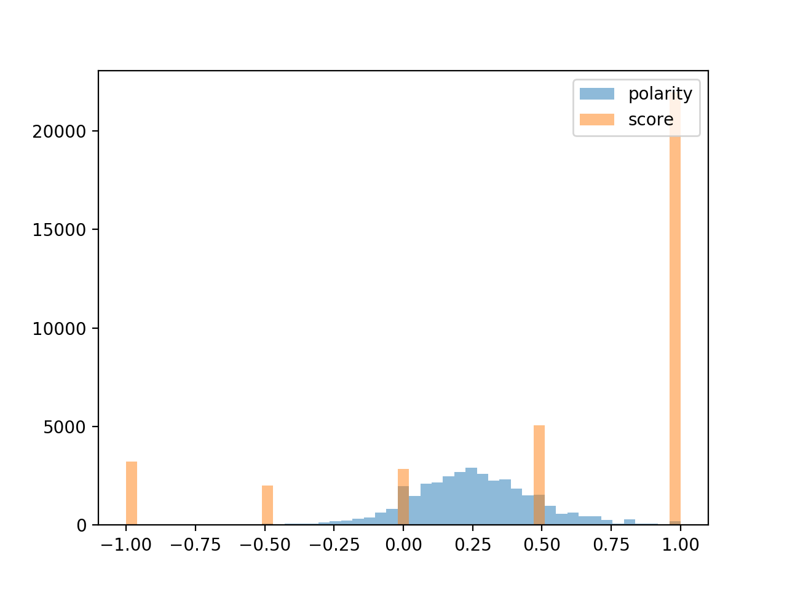

However, by observing the following scatterplot representing the correlation, it is possible to notice a slight increase in polarity in the reviews with 2, 3 and 4 stars, with a reversal of trend with regard to 5-star reviews.
The Pearson correlation coefficient is equal to 0.40886257, therefore a moderate correlation is still present. It can be assumed that the reversal of the polarity trend in 5-star reviews is due to a greater presence of "strong" words within the reviews with more extreme votes; this in some cases can lead to incorrect evaluation of the polarity. For example a review of the type "*Will always buy these if I can find them. Hate to have to buy from Germany. Need a grocery store.*" because of the word '*hate*' has a very negative polarity despite the 5-star score.

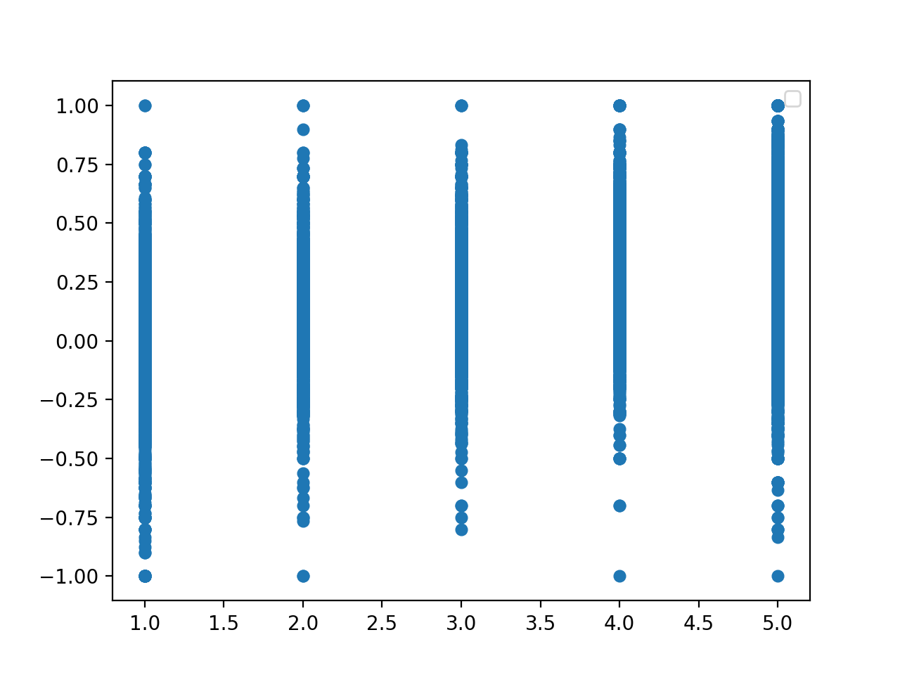

## Review Classification
The goal of this analysis is to identify of positive and negative reviews based on the text of the review using a Logistic Regression model.
The dataset has been split into train set (75%) and test set(25%)
The following learning curve graph shows how the model can identify very easily positive and negative reviews distinguishing words that characterize positive or negative reviews.

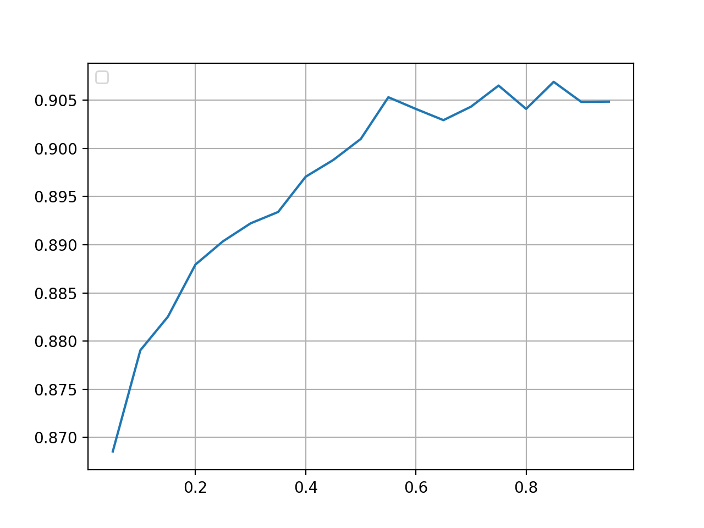

After a dataset random undersampling the amount of positive and negative reviews has been balanced, improving the classification results:

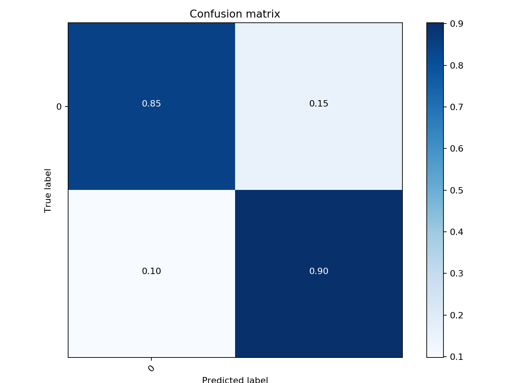

